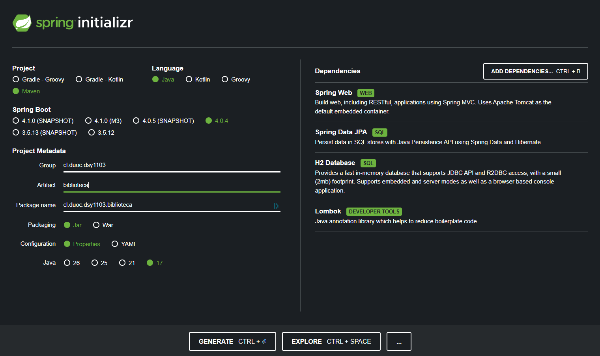
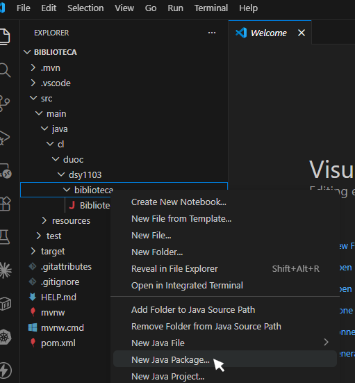
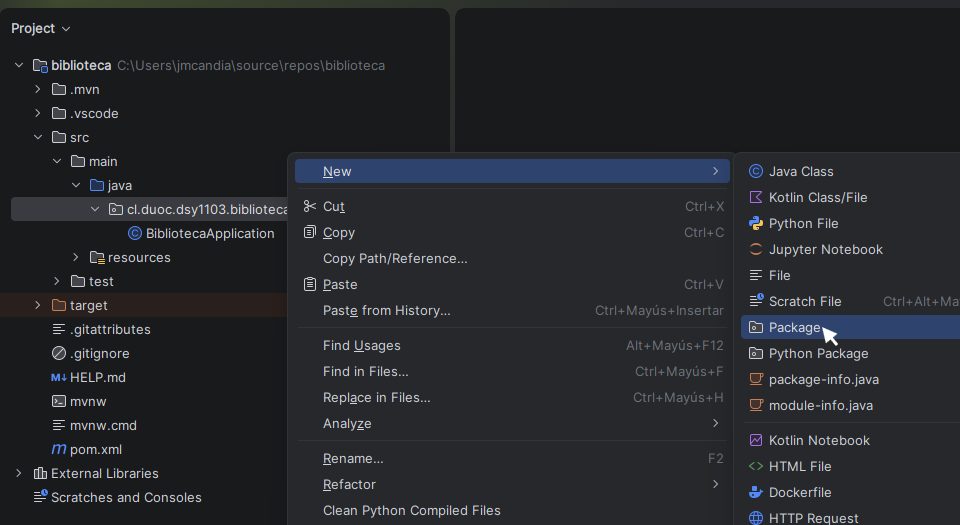
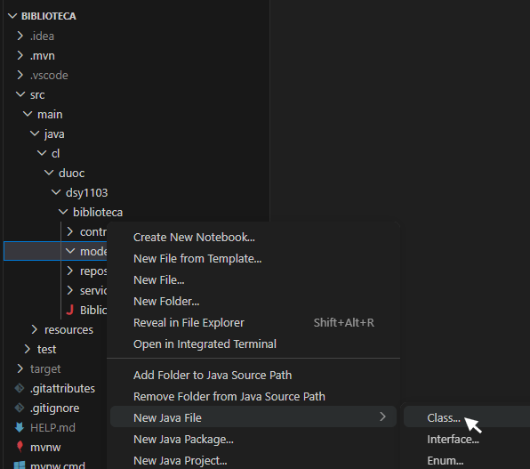
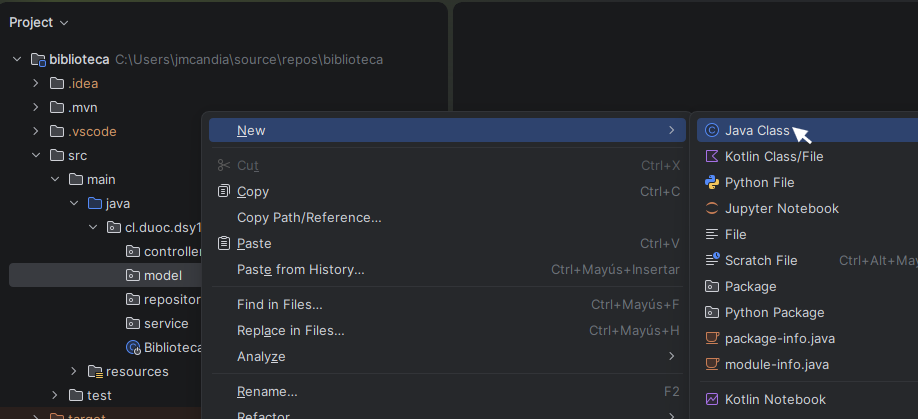
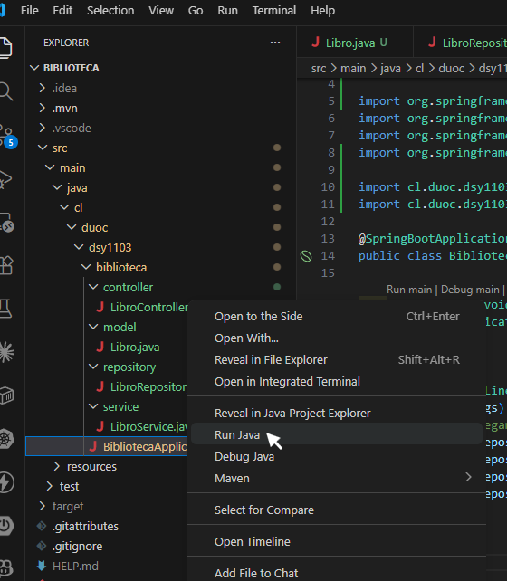
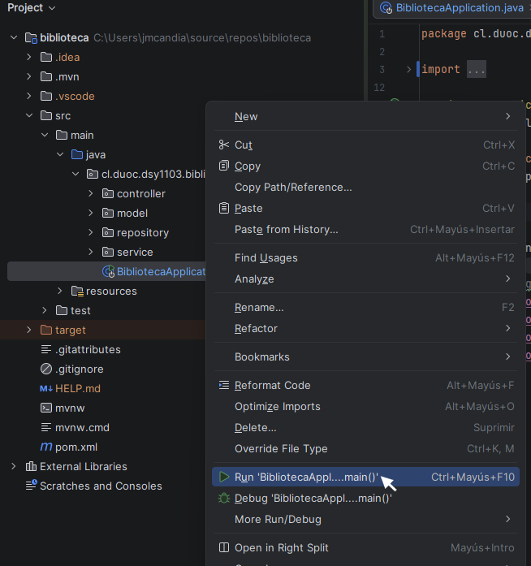
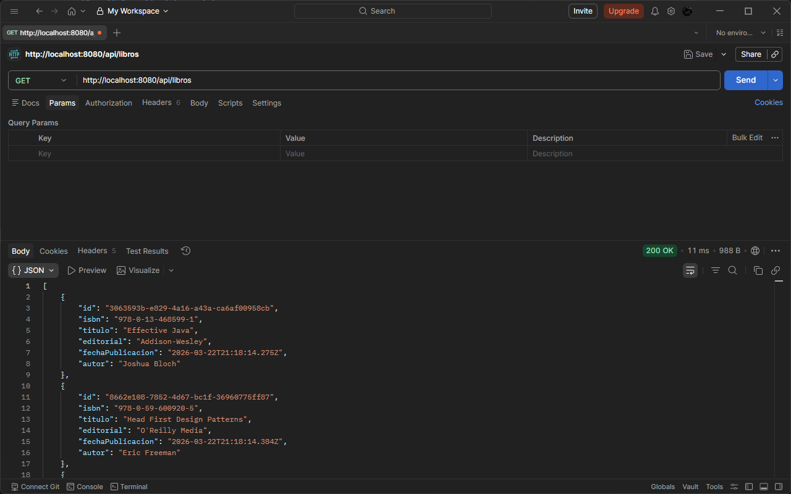
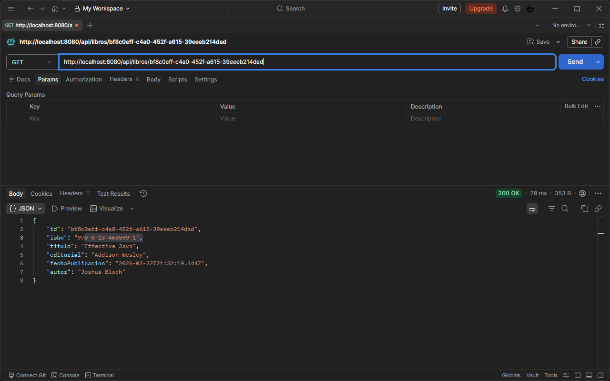

# Guía Práctica: Biblioteca

Este es un proyecto completo desarrollado en Java para explicar el desarrollo de una aplicación API Restful.

- [Guía Práctica: Biblioteca](#guía-práctica-biblioteca)
  - [Herramientas](#herramientas)
  - [Generación del proyecto](#generación-del-proyecto)
  - [Creación del servicio](#creación-del-servicio)

## Herramientas

- [Spring Initializr](https://start.spring.io/): es una herramienta web que permite generar rápidamente la estructura base de un proyecto Spring Boot con las dependencias necesarias.
- [Visual Studio Code](https://code.visualstudio.com/): es un editor de código ligero, rápido y altamente extensible.
- [IntelliJ IDEA](https://www.jetbrains.com/es-es/idea/download): es un IDE profesional muy completo, especialmente optimizado para Java.

## Generación del proyecto

El primer paso es ingresar a [**Spring Initializr**](https://start.spring.io/), e ingresar la siguiente información:

- **Project:** Define la herramienta de construcción del proyeco. Usaremos la opción `Maven`.
- **Language:** Selecciona el lenguaje de programación para el proyecto. Seleccionaremos la opción `Java`.
- **Spring Boot:** Permite elegir la versión del framework. Las versiones marcadas como **SNAPSHOT** o **M3** son experimentales, por lo que se recomienda usar alguna versión estable para trabajar. Seleccionaremos la versión `4.0.4`.
- **Project Metadata:** Define la identidad del proyecto.
  - **Group:** Representa el dominio de la organización. En este proyecto, usaremos `cl.duoc.dsy1103`.
  - **Artifact:** Corresponde al nombre del proyecto. Ingresaremos `biblioteca`.
  - **Package name:** Corresponde al nombre paquete base del proyecto. Usualmente es la unión del nombre del grupo con el del artefacto. Usaremos el valor por defecto `cl.duoc.dsy1103.biblioteca`.
  - **Packaging:** Define el tipo de salida del proyecto: **Jar** es un ejecutable que incluye un servidor embebido e ideal para microservicios; **War** es ideal para desplegar en servidores externos. Seleccionaremos la opción `Jar`.
  - **Configuration:** Define el formato del archivo de configuración: **Properties** usa un formato simple y recomendado para principiantes; **YAML** es más legible para configuraciones complejas. Usaremos la opción `Properties`.
  - **Java:** Selecciona la versión de Java. Por compatibilidad, seleccionaremos la versión `17`.
- **Dependencies:** Las dependencias agregan funcionalidades al proyecto.
  - `Spring Web`: Desarrolla aplicaciones web, incluidas las de tipo RESTful, utilizando Spring MVC. Utiliza Apache Tomcat como contenedor integrado por defecto.
  - `Spring Data JPA`: Almacena datos de forma persistente en bases de datos SQL con la API de persistencia de Java utilizando Spring Data e Hibernate.
  - `H2 Database`: Ofrece una base de datos rápida en memoria compatible con la API JDBC y el acceso R2DBC, con un tamaño reducido (2 MB). Admite los modos integrado y de servidor, así como una aplicación de consola basada en navegador.
  - `Lombok`: Biblioteca de anotaciones de Java que ayuda a reducir el código repetitivo.

La configuración debe verse como la imagen siguiente:



Con la configuración lista, crearemos el proyecto presionando el botón `GENERATE`. Esto generará y descargará un archivo `.zip` con toda la estructura necesaria.

Una vez descargado el archivo, debemos descomprimirlo en una carpeta. Por ejemplo `C:\Proyectos\biblioteca`.

El siguiente paso, es abrir el proyecto usando el IDE de tu elección:

1. [Visual Studio Code](https://code.visualstudio.com/)
   a) Abre VS Code
   b) Selecciona **File → Open Folder**
   c) Elige la carpeta del proyecto
   d) Instala las extensiones sugeridas (Java y Spring Boot)

2. [IntelliJ IDEA](https://www.jetbrains.com/es-es/idea/download)
   a) Abre IntelliJ
   b) Selecciona **Open**
   c) Elige la carpeta del proyecto
   d) IntelliJ detectará automáticamente que es un proyecto Maven

Una vez abierto el proyecto, debemos verificar la estructura del proyecto. Deberías ver una estructura similar a esta:

```plaintext
.mvn/
src/
└── main/
    ├── java/
    │   └── cl/
    │       └── duoc/
    │           └── dsy1103/
    │               └── biblioteca/
    │                   └── BibliotecaApplication.java
    └── resources/
        ├── static
        ├── templates
        └── application.properties
target/
.gitattributes
.gitignore
HELP.md
mvnw
mvnw.cmd
pom.xml
```

Si todo está en orden, podemos empezar a programar.

## Creación del servicio

Antes de comenzar, vamos a inicializar el repositorio de `Git`, para asegurarnos de mantener el código fuente resguardado. Para ello, debemos realizar las siguientes acciones:

- Iniciar el repositorio:
  
  ```bash
  git init
  ```

- Configurar la identificación del usuario (si no se ha hecho de forma global previamente):

  ```bash
  git config user.name "Tu nombre"
  git config user.email "tu@correo.cl"
  ```

  > **Nota:** Esta acción define el usuario y correo solo para el repositorio local. Si deseas que esta información esté disponible para todos los repositorios futuros, debes incluir el parámetro `--global` en el comando. Por ejemplo `git config --global user.name "Tu nombre"`.

- Definir el nombre de la rama principal:

  ```bash
  git branch -M main
  ```

- Agregar todos los archivos al repositorio

  ```bash
  git add .
  ```

- Realizar la confirmación:

  ```bash
  git commit -m "chore: initial commit"
  ```

  > **Nota:** La forma en la que se redactan los mensajes de confirmación debe permitir que sean legibles para máquinas y humanos, por lo que se debe seguir la especificación de [Commits Convencionales](https://www.conventionalcommits.org/en/v1.0.0/).

Y ¡listo! El código ahora está seguro.

Como siguiente paso, dentro del proyecto vamos a empezar a estructurar las carpetas necesarias, creando nuevos paquetes. Para ello, vamos a navegar hasta `src/main/java/cl/duoc/dsy1103/biblioteca` y vamos a crear los siguientes paquetes:

- `controller`: Claves de entrada REST.
- `model`: Clases de dominio o entidades de base de datos.
- `repository`: Acceso a base de datos.
- `service`: Lógica de negocios y servicios.

Para crear los paquetes en los distintos IDEs:

- Visual Studio Code:
  

- IntelliJ IDEA
  

La estructura debe quedar de la siguiente manera:

```plaintext
.mvn/
src/
└── main/
    ├── java/
    │   └── cl/
    │       └── duoc/
    │           └── dsy1103/
    │               └── biblioteca/
    │                   ├── controller/
    │                   ├── model/
    │                   ├── repository/
    │                   ├── service/
    │                   └── BibliotecaApplication.java
    └── resources/
        ├── static
        ├── templates
        └── application.properties
target/
.gitattributes
.gitignore
HELP.md
mvnw
mvnw.cmd
pom.xml
```

Con la estrucutra creada, vamos a generar el primer modelo. Para ello, vamos al paquete `model` y creamos una nueva clase.

- Visual Studio Code:
  

- IntelliJ IDEA:
  

A esta nueva clase la llamaremos `Libro`. El contenido inicial de esta clase debe ser el siguiente:

```java
package cl.duoc.dsy1103.biblioteca.model;

public class Libro {

}
```

Con la nueva clase, agregaremos el contenido necesario para almacenar distintos libros:

```java
package cl.duoc.dsy1103.biblioteca.model;

import java.util.Date;

import jakarta.persistence.Entity;
import jakarta.persistence.GeneratedValue;
import jakarta.persistence.GenerationType;
import jakarta.persistence.Id;
import lombok.AllArgsConstructor;
import lombok.Data;
import lombok.NoArgsConstructor;

@Data // Genera automáticamente getters, setters, toString, equals y hashCode
@Entity // Define esta clase como una entidad de JPA
@NoArgsConstructor // Genera un constructor sin argumentos requerido por JPA
@AllArgsConstructor // Genera un constructor con argumentos para todos los campos
public class Libro {
    @Id // Indica que este campo es la clave primaria de la entidad
    @GeneratedValue(strategy = GenerationType.UUID) // Genera automáticamente un UUID para el campo id
    private String id;
    private String isbn;
    private String titulo;
    private String editorial;
    private Date fechaPublicacion;
    private String autor;
}
```

Con el modelo listo, ahora vamos a generar un nuevo repositorio, dentro del paquete `repository`. Para ello, crearemos una nueva clase llamada `LibroRepository`.

```java
package cl.duoc.dsy1103.biblioteca.repository;

public class LibroRepository {

}
```

En este archivo, modificaremos `class` por `interface`, e incorporaremos el código para asegurarnos que el repositorio pueda hacer efectuar la comunicación con la base de datos:

```java
package cl.duoc.dsy1103.biblioteca.repository;

import org.springframework.data.repository.CrudRepository;
import org.springframework.stereotype.Repository;

import cl.duoc.dsy1103.biblioteca.model.Libro;

@Repository // Indica que esta interfaz es un repositorio de Spring Data JPA
public interface LibroRepository extends CrudRepository<Libro, String> {
    // Al extender CrudRepository, esta interfaz hereda métodos para realizar
    // operaciones CRUD (Create, Read, Update, Delete) en la entidad Libro.

    Libro findByIsbn(String isbn); // Método personalizado para buscar un libro por su ISBN
}
```

Ahora es momento de añadir el servicio que nos proporcionará las reglas de negocio. Para ellos, creamos una nueva clase con el nombre `LibroService` en el paquete `service`.

```java
package cl.duoc.dsy1103.biblioteca.service;

public class LibroService {

}
```

En esta clase debemos agregar el código que nos permitirá interactuar con el repositorio:

```java
package cl.duoc.dsy1103.biblioteca.service;

import java.util.List;

import org.springframework.beans.factory.annotation.Autowired;
import org.springframework.stereotype.Service;

import cl.duoc.dsy1103.biblioteca.model.Libro;
import cl.duoc.dsy1103.biblioteca.repository.LibroRepository;

@Service // Indica que esta clase es un servicio de Spring, lo que permite su inyección en otros componentes
public class LibroService {

    @Autowired // Inyecta automáticamente una instancia de LibroRepository en esta clase
    private LibroRepository libroRepository;

    public List<Libro> getAllLibros() {
        // Devuelve una lista de todos los libros en la base de datos
        return (List<Libro>) libroRepository.findAll();
    }

    public Libro getLibroById(String id) {
        // Busca un libro por su ID y devuelve null si no se encuentra
        return libroRepository.findById(id).orElse(null);
    }

    public Libro getLibroByIsbn(String isbn) {
        // Busca un libro por su ISBN utilizando el método personalizado
        // del repositorio y devuelve null si no se encuentra
        return libroRepository.findByIsbn(isbn).orElse(null);
    }

    public Libro addLibro(Libro libro) {
        // Guarda un nuevo libro o actualiza uno existente en la base de datos
        return libroRepository.save(libro);
    }

    public Libro updateLibro(String id, Libro libro) {
        // Actualiza un libro existente si se encuentra por su ID
        if (libroRepository.existsById(id)) {
            libro.setId(id); // Asegura que el ID del libro a actualizar se mantenga igual
            return libroRepository.save(libro); // Guarda el libro actualizado
        }
        return null; // Devuelve null si el libro no existe
    }

    public boolean deleteLibro(String id) {
        // Elimina un libro por su ID si existe en la base de datos
        if (libroRepository.existsById(id)) {
            libroRepository.deleteById(id); // Elimina el libro
            return true; // Devuelve true si la eliminación fue exitosa
        }
        return false; // Devuelve false si el libro no existe
    }
}
```

Por último, crearemos el controlador. Para ello, agregaremos en el paquete `controller` una nueva clase llamada `LibroController`.

```java
package cl.duoc.dsy1103.biblioteca.controller;

public class LibroController {

}
```

Desde acá vamos a consumir el servicio creado en el paso anterior, con el siguiente código:

```java
package cl.duoc.dsy1103.biblioteca.controller;

import java.util.List;

import org.springframework.beans.factory.annotation.Autowired;
import org.springframework.web.bind.annotation.DeleteMapping;
import org.springframework.web.bind.annotation.GetMapping;
import org.springframework.web.bind.annotation.PathVariable;
import org.springframework.web.bind.annotation.PostMapping;
import org.springframework.web.bind.annotation.PutMapping;
import org.springframework.web.bind.annotation.RequestBody;
import org.springframework.web.bind.annotation.RequestMapping;
import org.springframework.web.bind.annotation.RestController;

import cl.duoc.dsy1103.biblioteca.model.Libro;
import cl.duoc.dsy1103.biblioteca.service.LibroService;


@RestController // Indica que esta clase es un controlador REST de Spring
@RequestMapping("/api/libros") // Define la ruta base para todas las solicitudes relacionadas con libros
public class LibroController {
    @Autowired // Inyecta automáticamente una instancia de LibroService en esta clase
    private LibroService libroService;

    // Endpoint para listar todos los libros
    @GetMapping
    public List<Libro> getAllLibros() {
        // Llama al servicio para obtener todos los libros
        return libroService.getAllLibros();
    }
    
    // Endpoint para obtener un libro por su ID
    @GetMapping("/{id}")
    public Libro getLibroById(@PathVariable String id) {
        // Llama al servicio para obtener un libro por su ID
        return libroService.getLibroById(id);
    }

    // Endpoint para obtener un libro por su ISBN
    @GetMapping("/isbn/{isbn}")
    public Libro getLibroByIsbn(@PathVariable String isbn) {
        // Llama al servicio para obtener un libro por su ISBN
        return libroService.getLibroByIsbn(isbn);
    }

    // Endpoint para agregar un nuevo libro
    @PostMapping
    public Libro addLibro(@RequestBody Libro libro) {
        // Llama al servicio para agregar un nuevo libro
        return libroService.addLibro(libro);
    }

    // Endpoint para actualizar un libro existente
    @PutMapping("/{id}")
    public Libro updateLibro(@PathVariable String id, @RequestBody Libro libro) {
        // Llama al servicio para actualizar un libro existente
        return libroService.updateLibro(id, libro);
    }

    // Endpoint para eliminar un libro por su ID
    @DeleteMapping("/{id}")
    public boolean deleteLibro(@PathVariable String id) {
        // Llama al servicio para eliminar un libro por su ID
        return libroService.deleteLibro(id);
    }
}
```

Por último, y solo como opcional, vamos a incorporar un método que nos permita tener datos precargados desde el inicio. Para ellos, vamos a la clase `BibliotecaApplication` y añadimos el siguiente código:

```java
package cl.duoc.dsy1103.biblioteca;

import java.util.Date;

import org.springframework.boot.CommandLineRunner;
import org.springframework.boot.SpringApplication;
import org.springframework.boot.autoconfigure.SpringBootApplication;
import org.springframework.context.annotation.Bean;

import cl.duoc.dsy1103.biblioteca.model.Libro;
import cl.duoc.dsy1103.biblioteca.repository.LibroRepository;

@SpringBootApplication
public class BibliotecaApplication {
    public static void main(String[] args) {
        SpringApplication.run(BibliotecaApplication.class, args);
    }

    @Bean
    public CommandLineRunner initData(LibroRepository libroRepository) {
        return (args) -> {
            // Agregamos null al principio para el campo 'id'
            libroRepository.save(new Libro(null, "978-0-13-468599-1", "Effective Java", "Addison-Wesley", new Date(), "Joshua Bloch"));
            libroRepository.save(new Libro(null, "978-0-59-600920-5", "Head First Design Patterns", "O'Reilly Media", new Date(), "Eric Freeman"));
            libroRepository.save(new Libro(null, "978-1-491-94728-5", "Spring in Action", "Manning Publications", new Date(), "Craig Walls"));
            libroRepository.save(new Libro(null, "978-1-59327-584-6", "Automate the Boring Stuff with Python", "No Starch Press", new Date(), "Al Sweigart"));
        };
    }
}
```

Ahora, podemos ejecutar nuestro código:

- Desde Visual Studio Code
  

- Desde IntelliJ IDEA
  

Desde una herramienta como Postman, ingresamos a `http://localhost:8080/api/libros` usando el verbo `GET` y podremos ver el listado de los libros:



Para obtener un solo libro, copiamos cualquier ID del listado y navegamos a la ruta `http://localhost:8080/api/libros/{id}` reemplazando `{id}` con el valor seleccionado, y usando `GET` como verbo. Por ejemplo `http://localhost:8080/api/libros/bf8c0eff-c4a0-452f-a615-39eeeb214dad`.



Ya tenemos funcionando el código, así que vamos a guardar los cambios en `Git`:

```bash
git add .
git commit -m "feat(libros): adds books CRUD functions"
```

Para asegurarnos que nuestro servicio pueda responder con el mensaje adecuado cuando no encuentre el recurso, vamos a agregar un nuevo paquete llamado `exception` dentro de la aplicación `biblioteca`. Una vez creado el nuevo paquete, crearemos una nueva clase llamada `NotFoundException`:

```java
package cl.duoc.dsy1103.biblioteca.exception;

import org.springframework.http.HttpStatus;
import org.springframework.web.bind.annotation.ResponseStatus;

@ResponseStatus(HttpStatus.NOT_FOUND) // Indica que esta excepción corresponde a un error 404 Not Found
public class NotFoundException extends RuntimeException {
    public NotFoundException() {
        // Constructor sin argumentos que llama al constructor de la clase padre RuntimeException
        super();
    }

    public NotFoundException(String message) {
        // Llama al constructor de la clase padre RuntimeException con el mensaje de error
        super(message); 
    }
}
```

Ahora, implementamos la excepción en el servicio `LibroService`:

```java
package cl.duoc.dsy1103.biblioteca.service;

import java.util.List;
import java.util.Optional;

import org.springframework.beans.factory.annotation.Autowired;
import org.springframework.stereotype.Service;

import cl.duoc.dsy1103.biblioteca.exception.NotFoundException;
import cl.duoc.dsy1103.biblioteca.model.Libro;
import cl.duoc.dsy1103.biblioteca.repository.LibroRepository;

@Service // Indica que esta clase es un servicio de Spring, lo que permite su inyección en otros componentes
public class LibroService {

    @Autowired // Inyecta automáticamente una instancia de LibroRepository en esta clase
    private LibroRepository libroRepository;

    public List<Libro> getAllLibros() {
        // Devuelve una lista de todos los libros en la base de datos
        return (List<Libro>) libroRepository.findAll();
    }

    public Libro getLibroById(String id) {
        // Busca un libro por su ID y devuelve null si no se encuentra
        // UPDATE: Cambiado para lanzar una excepción si el libro no se encuentra, en lugar de devolver null
        return libroRepository.findById(id).orElseThrow(() -> new NotFoundException("Libro no encontrado con ID: " + id));
    }

    public Libro getLibroByIsbn(String isbn) {
        // Busca un libro por su ISBN utilizando el método personalizado
        // del repositorio y devuelve null si no se encuentra
        // UPDATE: Cambiado para lanzar una excepción si el libro no se encuentra, en lugar de devolver null
        return libroRepository.findByIsbn(isbn).orElseThrow(() -> new NotFoundException("Libro no encontrado con ISBN: " + isbn));
    }

    public Libro addLibro(Libro libro) {
        // Guarda un nuevo libro o actualiza uno existente en la base de datos
        return libroRepository.save(libro);
    }

    public Libro updateLibro(String id, Libro libro) {
        // UPDATE: Cambiado para verificar si el libro existe antes de intentar actualizarlo, y lanzar una excepción si no se encuentra
        // Actualiza un libro existente si se encuentra por su ID
        if (!libroRepository.existsById(id)) {
            // Lanza una excepción si el libro no se encuentra para actualizar
            throw new NotFoundException("Libro no encontrado con ID: " + id);
        }
        libro.setId(id); // Asegura que el ID del libro a actualizar se mantenga igual
        return libroRepository.save(libro); // Guarda el libro actualizado
    }

    public void deleteLibro(String id) {
        // UPDATE: Cambiado para verificar si el libro existe antes de intentar eliminarlo, y lanzar una excepción si no se encuentra
        // Elimina un libro por su ID si existe en la base de datos
        if (!libroRepository.existsById(id)) {
            // Lanza una excepción si el libro no se encuentra para eliminar
            throw new NotFoundException("Libro no encontrado con ID: " + id);
        }
        libroRepository.deleteById(id); // Elimina el libro
    }
}
```

Por último, modificamos el método `deleteLibro` en controlador `LibroController` para retornar `void` en lugar de `boolean`:

````java
package cl.duoc.dsy1103.biblioteca.controller;

.
.
.

@RestController // Indica que esta clase es un controlador REST de Spring
@RequestMapping("/api/libros") // Define la ruta base para todas las solicitudes relacionadas con libros
public class LibroController {
    @Autowired // Inyecta automáticamente una instancia de LibroService en esta clase
    private LibroService libroService;

    .
    .
    .

    // Endpoint para eliminar un libro por su ID
    @DeleteMapping("/{id}")
    public void deleteLibro(@PathVariable String id) {
        // Llama al servicio para eliminar un libro por su ID
        libroService.deleteLibro(id);
    }
}
```

Al final, la estructura del proyecto debe ser la siguiente:

```plaintext
.mvn/
src/
└── main/
    ├── java/
    │   └── cl/
    │       └── duoc/
    │           └── dsy1103/
    │               └── biblioteca/
    │                   ├── controller/
    │                   │   └── LibroController.java
    │                   ├── exception/
    │                   │   └── NotFoundException.java
    │                   ├── model/
    │                   │   └── Libro.java
    │                   ├── repository/
    │                   │   └── LibroRepository.java
    │                   ├── service/
    │                   │   └── LibroService.java
    │                   └── BibliotecaApplication.java
    └── resources/
        ├── static
        ├── templates
        └── application.properties
target
.gitattributes
.gitignore
HELP.md
mvnw
mvnw.cmd
pom.xml
```

Ya tenemos funcionando el código, así que vamos a guardar los cambios en `Git`:

```bash
git add .
git commit -m "feat(libros): add not found exception"
```
